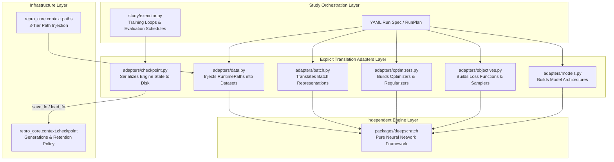

# Adapter Boundary & Representation Translation

This document defines the architecture, contracts, and responsibilities of **Adapters** in the monorepo.

---

## 1. Why Explicit Adapters?

In this monorepo:
* **`packages/deepscratch`** is a standalone, independent deep learning library with zero knowledge of repository infrastructure, CLI planning, or MLflow schemas.
* **`packages/repro-core`** provides generic experiment contracts, paths, and retention policies, but has zero knowledge of neural network architectures, autograd models, or parameter dictionaries.
* **`studies/*`** (e.g. `studies/dlfs`) is the composition layer where experiment configurations are translated into executable engine instances and tracked.

To prevent implementation-specific assumptions from leaking into infrastructure packages, and to prevent study orchestration from becoming cluttered with raw framework instantiation details, all representation translation is isolated in **explicit adapter modules**.



---

## 2. Strict Adapter Invariants

1. **Translation Only:**
   An adapter contains **only** translation and binding between repository representations (YAML configs, `RuntimePaths`, `CheckpointManager`) and engine-native representations (`deepscratch.nn.model`, `deepscratch.optim`, NumPy arrays).
2. **No Orchestration Leaks:**
   Adapters do **not** take over experiment orchestration. Evaluation policies, evaluation scheduling, validation slicing, learning rate decay schedules, prediction recording, attention heatmaps, and observation executors remain in the study executor layer.
3. **Pure Checkpoint Delegation:**
   `repro-core`'s `CheckpointManager` manages retention policy, generational naming, atomic tmp-file rename, SHA256 digests, and pointer JSONs (`latest.json`, `best.json`, `final.json`). The study checkpoint adapter (`dlfs.adapters.checkpoint`) owns how engine parameters, optimizer buffers, and RNG streams are serialized and restored.

---

## 3. Standard Module Layout for Study Adapters

Study adapters are organized modularly under `studies/<study>/src/<study>/adapters/` (study-wide) and `studies/<study>/src/<study>/<volume>/implemented/adapters/` (volume-specific):

```text
studies/dlfs/src/dlfs/
├── adapters/
│   ├── __init__.py
│   └── checkpoint.py           # DeepScratch state serialization & CheckpointManager factory
├── ds1/implemented/adapters/
│   ├── __init__.py
│   ├── models.py               # DS1 architectures (MLP, SimpleCNN, DeepCNN, TwoLayerNet)
│   ├── objectives.py           # DS1 losses (SoftmaxCrossEntropy)
│   ├── optimizers.py           # DS1 optimizers (SGD, Momentum, AdaGrad, Adam, L2Regularization)
│   └── data.py                 # MNIST loader with RuntimePaths injection
└── ds2/implemented/adapters/
    ├── __init__.py
    ├── models.py               # DS2 architectures (CBOW, SkipGram, RNNLM, BetterRNNLM, Seq2Seq)
    ├── objectives.py           # DS2 objectives (SoftmaxWithLoss, TimeSoftmaxWithLoss, NegativeSampling)
    ├── optimizers.py           # DS2 optimizers (Adam, SparseAdam, SGD, ClipGradNorm)
    ├── batch.py                # DS2 batch adapters (CBOWBatchAdapter, SkipGramBatchAdapter)
    └── data.py                 # PTB and sequence loaders with RuntimePaths injection
```

---

## 4. Key Adapter Contracts

### 4.1 Checkpoint Serialization Adapter (`adapters/checkpoint.py`)
```python
def write_deepscratch_checkpoint(
    staging_path: Path,
    *,
    model: Any = None,
    objective: Any = None,
    optimizer: Any = None,
    trainer: Any = None,
    config_digest: str | None = None,
) -> None:
    """Serializes weights, buffers, optimizer state, and backend RNG to staging_path."""
    ...


def load_deepscratch_checkpoint(
    path: Path,
    *,
    model: Any = None,
    objective: Any = None,
    optimizer: Any = None,
    trainer: Any = None,
    config_digest: str | None = None,
) -> None:
    """Restores weights, buffers, optimizer state, and backend RNG from path."""
    ...


def create_deepscratch_checkpoint_manager(
    root: Path,
    *,
    model: Any = None,
    objective: Any = None,
    optimizer: Any = None,
    trainer: Any = None,
    config_digest: str | None = None,
    policy: CheckpointRetentionPolicy | None = None,
) -> CheckpointManager:
    """Factory creating a repro-core CheckpointManager wired to DeepScratch serialization."""
    ...
```

### 4.2 Dataset Path Injection Adapter (`adapters/data.py`)
```python
def load_ds1_mnist(
    *,
    flatten: bool = True,
    gpu: bool = False,
    paths: RuntimePaths | None = None,
) -> tuple[tuple[np.ndarray, np.ndarray], tuple[np.ndarray, np.ndarray]]:
    """Loads MNIST dataset injecting RuntimePaths dataset directory."""
    runtime_paths = paths or RuntimePaths.from_environment()
    data_dir = runtime_paths.dataset("mnist")
    return load_mnist(flatten=flatten, gpu=gpu, data_dir=data_dir)
```
