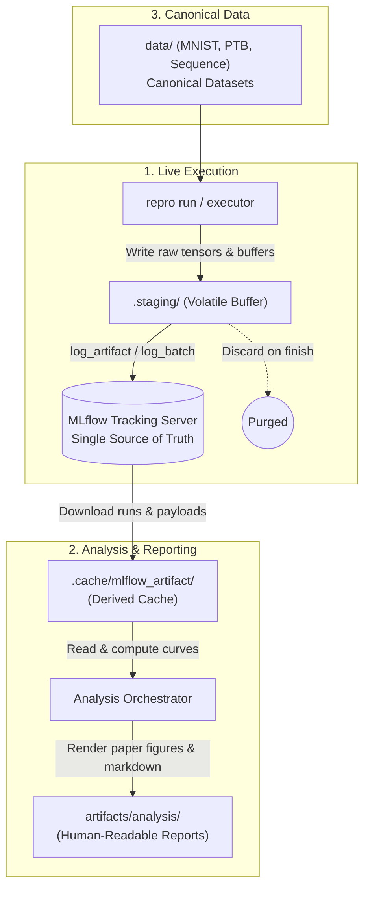

# Storage Policy, Caching & Path Resolution

This document specifies the exact lifecycle, storage tiers, and path resolution policies enforced across the monorepo.

---

## 1. Service Connection Contract

| Variable | Value and ownership | Consumer |
| :--- | :--- | :--- |
| `F1_MLFLOW_TRACKING_URI` | F1 MLflow HTTP(S) endpoint | DLFS run, check, analyze, and tracked profile workflows |
| `F1_MLFLOW_DATABASE_URL` | F1 MLflow PostgreSQL backend credentials | Infrastructure operators only; application code must not read it |
| `F2_MLFLOW_TRACKING_URI` | F2 MLflow HTTP(S) endpoint | F2 tracked workflows |
| `F2_MLFLOW_DATABASE_URL` | F2 MLflow PostgreSQL backend credentials | Infrastructure operators only; application code must not read it |
| `F2_CORPUS_DATABASE_URL` | F2 corpus PostgreSQL application database | F2 corpus CLI |

A tracking URI is an HTTP(S) application endpoint used by an MLflow client. A
database URL is a privileged direct PostgreSQL connection string; it must never
be substituted for a tracking URI or consumed by study runtime code. F1 owns the
DLFS tracking service, while F2 owns its campaign tracking service and corpus
database. There is no cross-study or generic fallback.

For a tracked study command, resolution is `--tracking-uri`, then that study's
dedicated environment variable, then a clear error. Resolution trims whitespace
and removes trailing `/` characters only. F2 corpus commands are not tracked and
therefore do not expose a tracking option.

Real endpoints and credentials belong in the uncommitted `.env` or the deployment
secret manager. `.env.example` contains placeholders only. Database credentials
must not appear in logs, CLI arguments, committed configuration, or application
artifacts.

---

## 2. Storage Tiers & Data Lifecycle



### 1) `.staging/` (Volatile Staging — Fully Ephemeral)
* **Purpose:** High-throughput in-memory/scratch buffer during live training.
* **Contents:** Working tensors, temporary event queues, intermediate checkpoint buffers.
* **Policy:**
  * Once a run finishes and MLflow upload completes, `.staging/` entries are safe to delete.
  * Can be cleaned anytime with `rm -rf .staging` without data loss.

### 2) `.cache/` (Derived Cache — 100% Reconstructible)
* **Purpose:** Acceleration of repeated I/O and expensive normalization computations.
* **Contents:**
  * `.cache/mlflow_artifact/`: Local copy of downloaded MLflow checkpoints and binary metrics.
  * `.cache/exp/<study>/.../analysis/cache.json`: Signature-cached intermediate statistical analysis results.
* **Policy:**
  * Never committed to git.
  * Can be cleaned anytime with `rm -rf .cache`; re-running analysis automatically reconstructs it from MLflow.

### 3) `artifacts/` (Human-Facing Reports & Results)
* **Purpose:** Permanent, human-inspectable deliverables and publication materials.
* **Contents:**
  * `artifacts/analysis/<study>/` or `artifacts/analysis/<study>/<suite>/` (resolved via `RuntimePaths.analysis_output(study, suite)`):
    * Publication-grade comparison charts (`.png`, `.pdf`)
    * Final statistical summaries and tables (`summary.md`, `summary.csv`)
    * Specialized corpus feasibility studies (`artifacts/analysis/f2/corpus/`)
    * Detailed observations (`observations.csv`)

### 4) `data/` (Canonical Datasets & Corpus Materialization)
* **Purpose:** Common dataset and corpus storage shared across all studies and packages.
* **Contents:**
  * Vision & NLP Benchmarks: MNIST (`.gz`, `.pkl`), PTB (`.txt`, `.npy`, `.pkl`), Sequence datasets (`.txt`).
  * Web-Scale Corpora: `data/f2/` (Extracted clean text shards, Parquet provenance manifests, tokenized datasets).
* **Policy:** Ignored by Git. Cached locally after first download/build.

---

## 3. MLflow Server & Database as Single Sources of Truth

**1) Externally managed MLflow services:**
All production run artifacts, checkpoints, manifests, and time-series metrics are uploaded to the study-owned MLflow service.

* The project root filesystem does **NOT** store raw run dumps during production runs.
* MLflow stores:
  * Full run configurations and parameter hashes
  * Time-series metrics (loss, accuracy, perplexity, elapsed times)
  * Generational checkpoints:
    * `checkpoints/generations/<role>-epoch-<E>-update-<U>-<digest>/`:
      * `model_parameters.npz`
      * `model_buffers.npz`
      * `objective_parameters.npz`
      * `objective_buffers.npz`
      * `optimizer_state.pkl`
      * `trainer_state.pkl`
      * `rng_state.pkl`
      * `manifest.json`
    * Pointers: `latest.json`, `best.json`, `final.json`
  * Lineage manifests (`result_manifest.json`, `checkpoint_manifest.json`)
* Upload verification (`_verify_uploaded_manifest`) ensures that runs are only marked `result.durable_complete = true` when all artifacts are durable in MLflow.

**2) PostgreSQL Databases:**
* **`F2_CORPUS_DATABASE_URL`:** Transaction-safe operational state storage for Common Crawl candidate sampling, feature extraction diagnostics, and gold human audit labels.
* **`F2_CATALOG_DATABASE_URL`:** Reproduction catalog database tracking papers, targets, experiment specifications, resource lineage/substitutions, execution plan revisions, and planned run slots.

---

## 4. 3-Tier Dataset Path Resolution Precedence

To allow `deepscratch` to run both as a standalone library and inside monorepo studies, dataset paths are resolved using a 3-tier fallback precedence:

```
Tier 1: Explicit Parameter (data_dir=...)
   │ (if None)
   ▼
Tier 2: Environment Variable ($DEEPSCRATCH_DATA_DIR)
   │ (if unset)
   ▼
Tier 3: Default Local Fallback (./data/<dataset>)
```

### Study-Level Path Injection (Dependency Injection)
Inside `studies/dlfs`, explicit dataset paths are injected from `repro-core`'s central resolver via translation adapters:

```python
# In studies/dlfs/src/dlfs/ds1/implemented/adapters/data.py
def load_ds1_mnist(*, flatten: bool = True, gpu: bool = False, paths=None):
    runtime_paths = paths or RuntimePaths.from_environment()
    data_dir = runtime_paths.dataset("mnist")
    return load_mnist(flatten=flatten, gpu=gpu, data_dir=data_dir)
```

---

## 5. Path Environment Variable Overrides

All storage roots can be overridden via environment variables for CI, remote cluster mounting, or high-performance scratch drives:

| Environment Variable | Default Path | Purpose |
| :--- | :--- | :--- |
| `REPRO_DATA_ROOT` | `./data` | Canonical dataset root |
| `REPRO_ARTIFACTS_ROOT` | `./artifacts` | Human-facing analysis deliverables |
| `REPRO_CACHE_ROOT` | `./.cache` | Reconstructible cache storage |
| `REPRO_STAGING_ROOT` | `./.staging` | Ephemeral scratch directory |
| `REPRO_REFERENCES_ROOT` | `./references` | Upstream vendored baselines |
